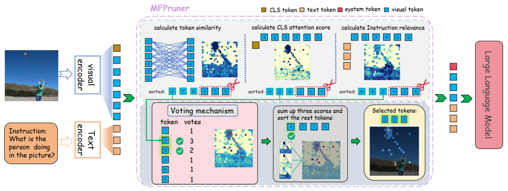
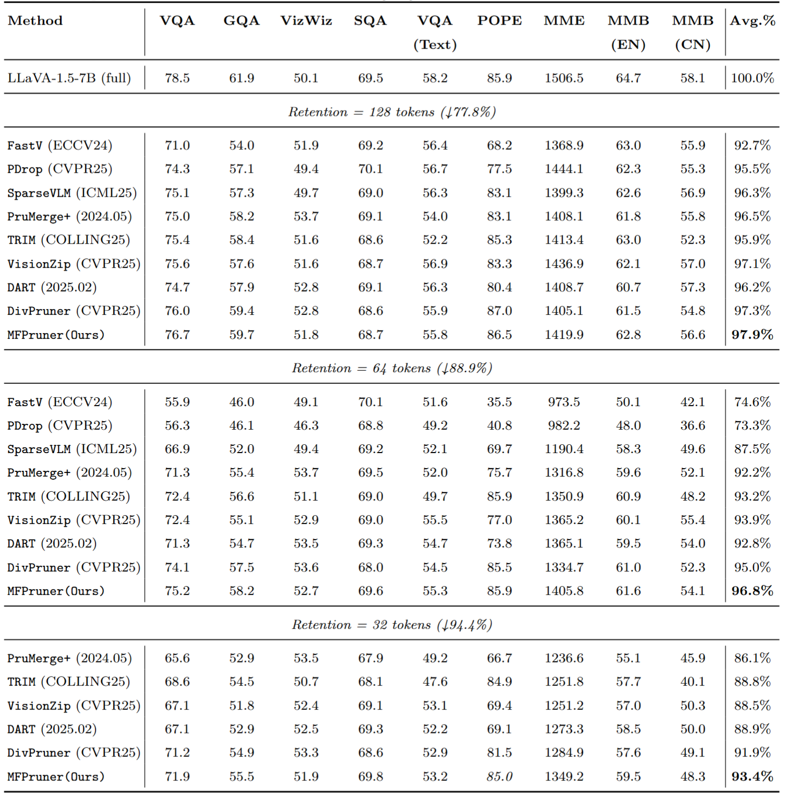
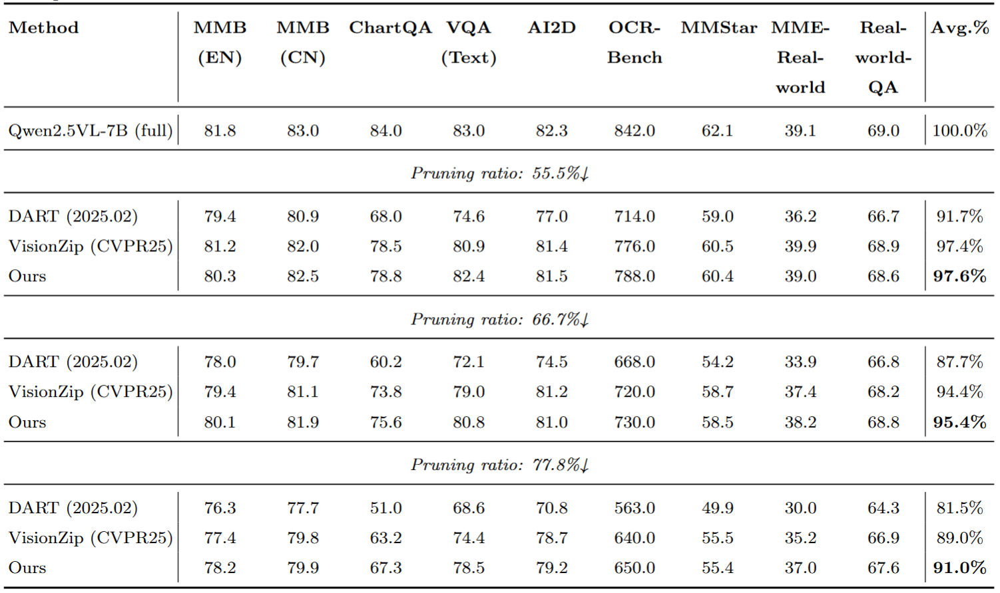
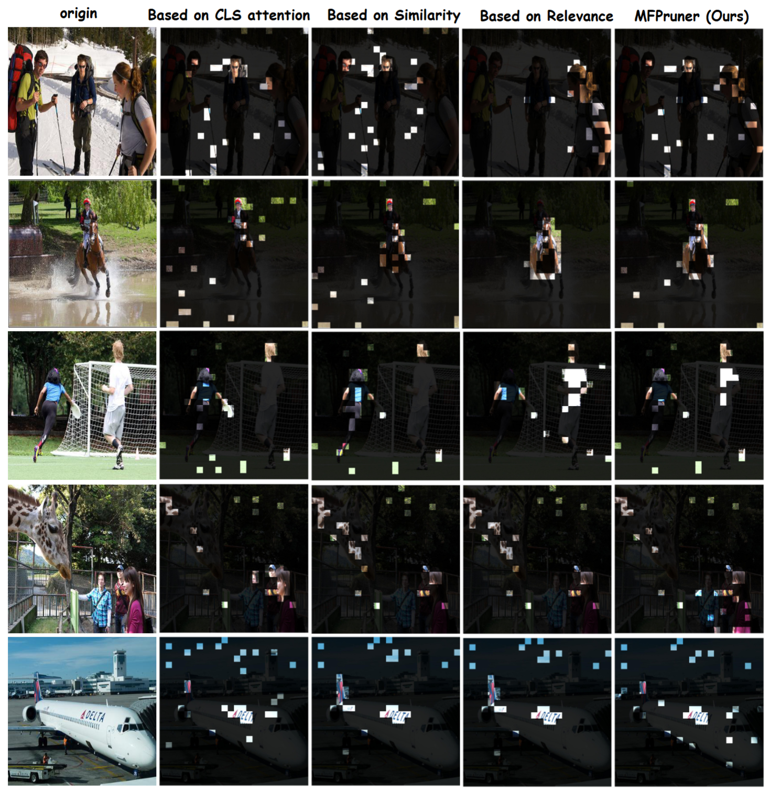

# Rethinking Attention Cues: Multi-Factor Guided Token Pruning for Efficient Vision-Language Understanding

<p align="center">
  <a href="LICENSE"></a>
  
  
</p>

> **TL;DR:** A simple multi-cue token pruning method for accelerating MLLMs while preserving accuracy.

## Abstract
Large vision-Language Models excel in multimodal understanding, but are often hindered by high computational latency originating from the redundancy within their vast visual token space. Existing pruning methods typically depend on a single cue of importance, such as [CLS] attention or token similarity. Our in depth analysis of these individual criteria revealed that relying on a single metric made them vulnerable to semantic degradation when pruning aggressively. We identified a critical gap: the synergistic effects and interactions among these cues were largely ignored, despite their clear potential to boost performance. To address this issue, we propose Multi-Factor Pruner (MFPruner), a training-free, plug-and-play framework. By synthesizing insights from different metrics, MFPruner uses a multidimensional pruning criterion to comprehensively evaluate the importance of each token. This is complemented by a unique voting-based mechanism that selects the most critical tokens by retaining only those that appear in at least two of the top-n rankings from different criteria, effectively capturing a cross-perspective consensus. By leveraging these multidimensional cues, MFPruner effectively preserves key semantic content while substantially gaining in efficiency. Without any retraining, it achieves state-of-the-art trade-offs between efficiency and accuracy on several benchmarks. For example, on LLaVA-1.5-7B, retaining just 32 tokens (a 94.4\% pruning ratio) maintains 93.4\% accuracy, reduces FLOPs by 94.6\%, and delivers a 3.42× prefilling speedup.

---

## Method Overview

<p align="center">
  
</p>


---

## Preparation

### LLaVA
1. Clone this repository.
```
git clone https://github.com/dluo112/MFPruner
cd MFPruner
````

2. Install necessary packages.
```bash
conda create -n mfpruner python=3.10 -y
conda activate mfpruner
pip install -e .
```
3. Download Multimodal Benchmark

Download each dataset according to [EVAL.md](EVAL.md).

### Qwen2.5-VL
We follow the evaluation scripts of [lmms-eval](https://github.com/EvolvingLMMs-Lab/lmms-eval). Simply change need to be done:
```
from transformers import Qwen2_5_VLForConditionalGeneration
```
to
```
from Qwen2_5VL_MFPruner import Qwen2_5_VLForConditionalGeneration
```
you can adjust the retain token ratio at line 1956
```
prune_ratio = 0.778 
k = int(N_img * (1 - prune_ratio))
```
###  Model

Download corresponding [LLaVA](https://github.com/haotian-liu/LLaVA/blob/main/docs/MODEL_ZOO.md) checkpoints from [Hugging Face](https://huggingface.co/liuhaotian) 🤗:

| Version | LLM | Checkpoint |
|----------|:----------:|:-----------:|
| LLaVA-1.5 | Vicuna-7B | [liuhaotian/llava-v1.5-7b](https://huggingface.co/liuhaotian/llava-v1.5-7b) |
| LLaVA-1.5 | Vicuna-13B | [liuhaotian/llava-v1.5-13b](https://huggingface.co/liuhaotian/llava-v1.5-13b) |
| LLaVA-1.6 (LLaVA-NeXT) | Vicuna-7B | [liuhaotian/llava-v1.6-vicuna-7b](https://huggingface.co/liuhaotian/llava-v1.6-vicuna-7b) |
| Qwen2.5-VL| Qwen2.5-7B | [Qwen/Qwen2.5-VL-7B-Instruct](https://huggingface.co/Qwen/Qwen2.5-VL-7B-Instruct)


## Evaluation

```bash
CUDA_VISIBLE_DEVICES=0 bash scripts/v1_5/eval/mme.sh 64
```

```bash
CUDA_VISIBLE_DEVICES=0 bash scripts/v1_6/eval/textvqa.sh 32
```

```
bash eval_scripts/lmms_eval.sh
```
The detailed guidance for evaluation commands and online submission of each benchmark can be found in [EVAL.md](EVAL.md).

---
## Main Results
### LLaVA-1.5-7B
<p align="center">
  
</p>

### Qwen2.5-VL-7B
<p align="center">
  
</p>

## Visualization
<p align="center">
  
</p>

### Acknowledgement
We appreciate the open-source efforts of [LLaVA](https://github.com/haotian-liu/LLaVA),[lmms-eval](https://github.com/EvolvingLMMs-Lab/lmms-eval), [CDPruner](https://github.com/Theia-4869/CDPruner.git) and [VisionZip](https://github.com/dvlab-research/VisionZip)

### License
This project is released under the [Apache 2.0 license](https://github.com/kixioo/MFPruner/blob/main/LICENSE).
